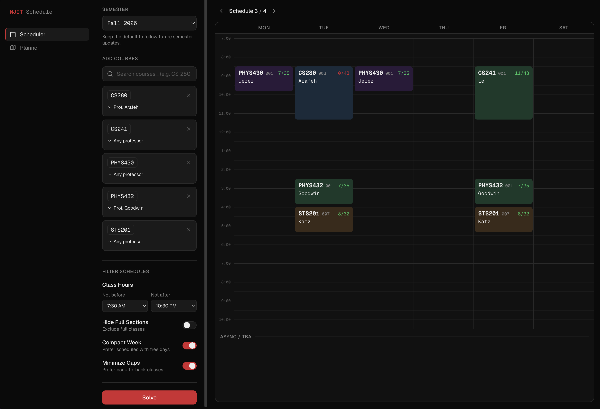

# NJIT Schedule Builder

Plan your classes and remaining semesters at NJIT. No account needed.

**[Open the app](https://njit-schedule-builder-web.vercel.app/scheduler)**

## Build your schedule

1. Choose a semester and add your courses.
2. Set your preferred class hours, days, and professors.
3. Generate schedules and compare options without overlapping classes.

You can also hide full sections and check Rate My Professors ratings.

## Plan your degree

1. Open the **Planner** tab and upload your DegreeWorks PDF.
2. Choose your starting semester, electives, and credits per semester.
3. Generate a plan to see how your remaining courses could fit together.

Always confirm degree requirements and available seats with NJIT before registering.

## Your data

Your choices and plans are saved in your browser. Uploaded PDFs are processed
without being saved on the server.

## Tech stack

| Area | Technologies |
| --- | --- |
| Frontend | Next.js, React, TypeScript, Tailwind CSS, Zustand |
| Backend | Python, FastAPI, SQLAlchemy |
| Database | PostgreSQL |
| Data collection | Playwright, httpx, pdfplumber |
| Deployment | Vercel, Railway, Docker, GitHub Actions |

## Implementation highlights

- **Schedule search:** uses backtracking to find compatible sections, then ranks
  results by campus days and gaps between classes.
- **Degree planning:** extracts requirements from DegreeWorks PDFs and builds
  semester plans using recorded prerequisites and credit targets.
- **Data updates:** collects course and professor data, with retry handling and
  database safeguards that preserve existing records when updates fail.
- **Deployment checks:** automated tests, type checks, and database schema
  verification run before backend deployment.

## Feedback

Found a bug or have a suggestion? [Open an issue](https://github.com/KingFeddy/ScheduleBuilder/issues).
Please leave personal information out of reports.

Maintained by [KingFeddy](https://github.com/KingFeddy).
